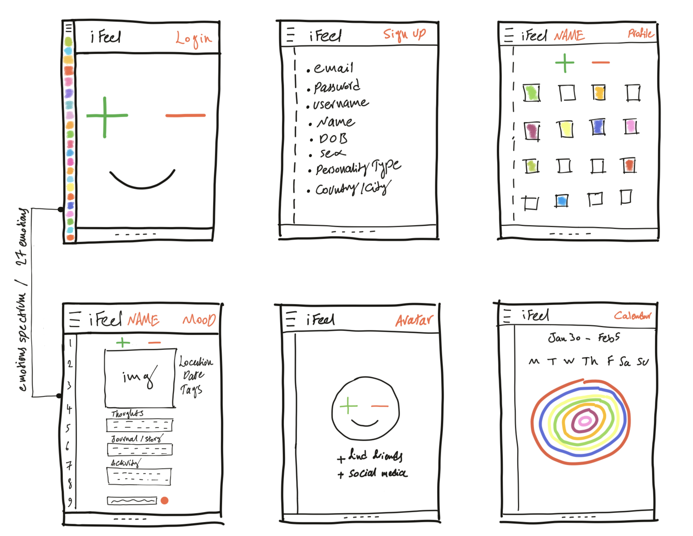
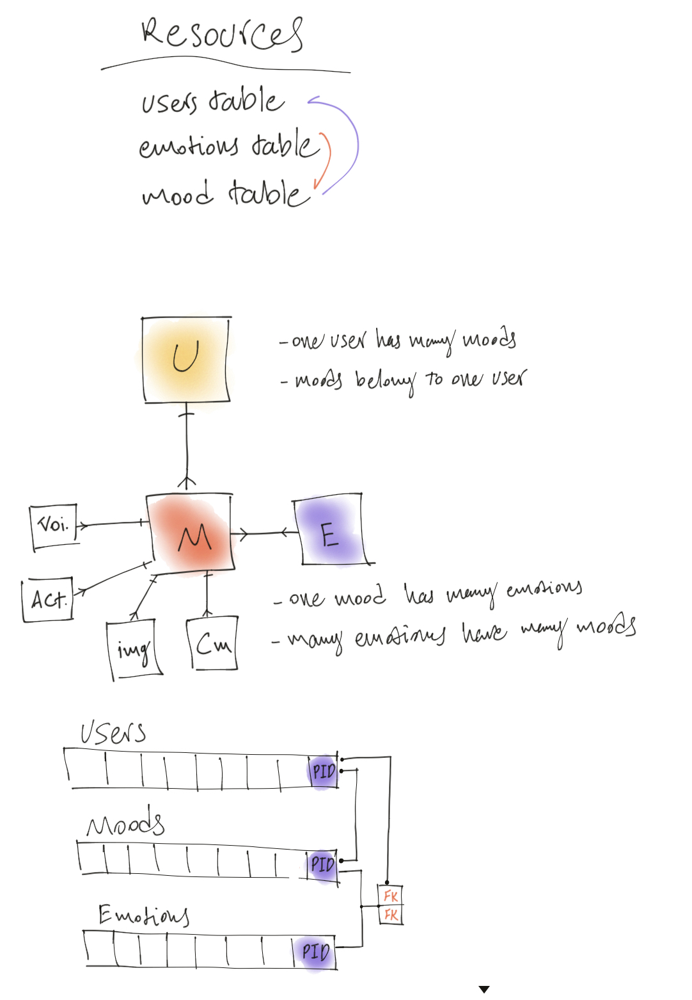
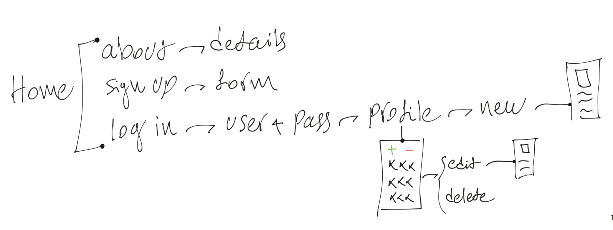

# Emotions Tracker

Click here to access: https://emotions-tracker.herokuapp.com/

The web app is developed on Ruby for submiting and tracking all your emotions and daily experiences in different circumstances.

The app provides a platform to be true to your inner emotions and experiences. You can upload images, write about your experiences, thoughts and choose from 27 emotions which can potentially be involed in that specific experience.

# How to Use

Simply sign up to track your emotions or use below details to log in and experience the flow of the web app.

* username: pooy4n@yahoo.com
* password: emotions

# Technologies Used

1. Made with Ruby and Sinatra
2. PostgreSQL database
3. bcrypt password hashing
4. HTML
5. CSS
6. Heroku to deploy

# Why?

# UI Design Diagram

# Resources Diagram

# Flow Diagram

### Hope you enjoy the app and please leave me your feedback